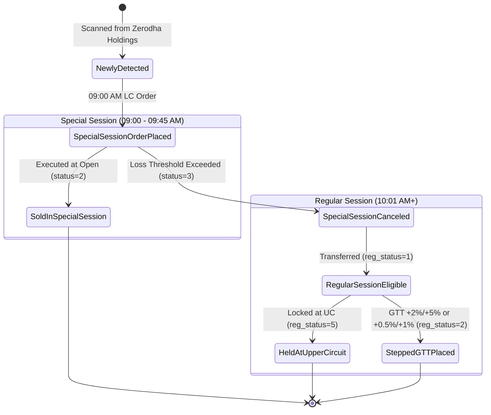

# CapitalFund1 — Data Dictionary & File Schemas

This document defines the data structures, Excel database schemas, column mappings, and lifecycle status codes utilized across CapitalFund1.

---

## 1. Primary Databases

CapitalFund1 relies on four primary Excel workbooks located at the project root:

1. `General.xlsx` — Primary IPO research, scoring, and performance tracking database.
2. `allotted_holdings.xlsx` — Multi-account portfolio allotment tracker.
3. `Master.xlsx` — Master user accounts, profiles, and portfolio valuations.
4. `IPO-applied.xlsx` — Audit log of submitted IPO applications.

---

## 2. `General.xlsx` Schema

Contains two core worksheets:
- `IPOMB` — Mainboard IPO listings
- `IPOSME` — SME Platform IPO listings (BSE SME & NSE Emerge)

### Key Column Mappings

| Col # | Column Name | Type | Description |
| :---: | :--- | :--- | :--- |
| **1** | `URL` | String | Chittorgarh detailed IPO profile URL. |
| **2** | `Company Name` | String | Official issuer company name. |
| **4** | `Listing Result` | Integer | Binary listing day performance flag: `1` = Positive (Listing Open $\ge$ Issue Price), `0` = Negative (Listing Open $<$ Issue Price). |
| **5** | `Total Score` | Float | Algorithmically computed evaluation score. |
| **7** | `GMP` | Float | Grey Market Premium in ₹ per share. |
| **8** | `GMP %` | Float | Grey Market Premium expressed as a percentage of issue price. |
| **11** | `Retail Subscription` | Float | Subscription times for retail category (e.g. `12.5x`). |
| **12** | `QIB Subscription` | Float | Subscription times for Qualified Institutional Buyers. |
| **13** | `NII Subscription` | Float | Subscription times for Non-Institutional Investors. |
| **20** | `P/E Ratio` | Float | Price-to-Earnings valuation multiple. |
| **40** | `ClosingDate` | Integer | Day of month when the IPO closes for subscription (e.g., `24`). |
| **42** | `Apply Priority` | Integer | Priority classification: `3` = Super Priority, `2` = High Priority, `1` = Normal Apply, `0` = Avoid / Do Not Apply. |
| **45** | `Issue Price` | Float | Final cutoff issue price per share (₹). |

---

## 3. `allotted_holdings.xlsx` Schema

Each registered account in `CAPITALFUND_USERS` possesses its own worksheet named after its numerical `uci` (e.g. Sheet `"1"`, Sheet `"2"`).

### Column Definitions

| Col # | Column Name | Type | Description |
| :---: | :--- | :--- | :--- |
| **1** | `security_name` | String | NSE/BSE trading scrip symbol (e.g. `BAJAJHFL`). |
| **2** | `lot_size` | Integer | Minimum lot quantity for the scrip. |
| **3** | `issue_price` | Float | Allotment issue price per equity share (₹). |
| **4** | `shares_allocated` | Integer | Total number of shares credited to the Demat account. |
| **5** | `allotment_date` | Date | Date when allotment was confirmed. |
| **6** | `exchange` | String | Primary listing exchange: `"NSE"` or `"BSE"`. |
| **8** | `special_session_status`| Integer | Pre-open special session execution status (see lifecycle below). |
| **11**| `regular_session_status`| Integer | Regular trading session execution status (see lifecycle below). |

---

## 4. Status Code Lifecycle Reference

The listing day automation utilizes two state-machine columns in `allotted_holdings.xlsx` to track orders without duplicates.



### 4.1 `special_session_status` (Column 8)

| Code | Status Meaning | Trigger Event & Description |
| :---: | :--- | :--- |
| `0` | **Not Started** | Default state before listing day actions commence. |
| `1` | **LC Order Placed** | Lower Circuit sell order successfully placed at 09:00 AM by `ss_sale_order_on_lc_on_start_of_ss.py`. |
| `2` | **Sold in Special Session** | Order was left active and executed during pre-open opening cross. Stock is fully liquidated. |
| `3` | **Order Canceled** | Order canceled at 09:32 AM because pre-open loss exceeded threshold (MB $> 11.9\%$, SME $< 0\%$). Handed over to regular session. |
| `5` | **Newly Allotted** | Initial state set by `allotment_update.py` upon discovering new allotment from Zerodha portfolio. |

### 4.2 `regular_session_status` (Column 11)

| Code | Status Meaning | Trigger Event & Description |
| :---: | :--- | :--- |
| `0` | **Not Started** | Stock was sold in special session (`special_session_status == 2`) or has not entered regular trading. |
| `1` | **Eligible for Regular Sell** | Special session order was canceled (`status == 3`). Stock is actively evaluated by `regular_session_sell.py`. |
| `2` | **GTT Orders Placed / Sold** | Stepped GTT exit orders (Order 1 & Order 2) were placed on Zerodha Kite. |
| `3` | **Not Sold in Regular** | Market session closed or order unfulfilled. |
| `5` | **Held at Upper Circuit (UC)** | Buyer/Seller ratio was $> 60\%$ and stock locked at Upper Circuit within 30 mins. Position held. |

---

## 5. `Master.xlsx` Schema ('Users' Sheet)

Synchronized automatically with credentials in `.env` via `master_excel_manager.py`:

| Col # | Column Header | Data Type | Description |
| :---: | :--- | :--- | :--- |
| **1** | `uci` | String/Int | Unique client ID matching `.env` and `allotted_holdings.xlsx`. |
| **2** | `first_name` | String | Account holder first name. |
| **3** | `last_name` | String | Account holder last name. |
| **4** | `mobile` | String | Linked contact number. |
| **5** | `communication email` | String | Notification email destination. |
| **6** | `account_email` | String | Gmail account receiving bank OTP forwards. |
| **7** | `intraday` | Integer | Mode flag (`1` for active intraday product, `0` otherwise). |
| **8** | `zerodha_access_token`| String | Kite Connect session or access token. |
| **9** | `current_value` | Float | Real-time aggregate portfolio valuation in ₹. |

---

## 6. `IPO-applied.xlsx` Schema

Each user account maintains an individual sheet named by `uci`:

| Col # | Column Header | Data Type | Description |
| :---: | :--- | :--- | :--- |
| **1** | `IPO-Name` | String | Name of the applied IPO scrip. |
| **2** | `Shares Applied` | Integer | Total quantity of shares applied in the bid. |
| **3** | `Issue price` | Float | Cutoff or bid issue price per share (₹). |
| **4** | `Total Application amount` | Float | Total blocked ASBA funds ($\text{Shares Applied} \times \text{Issue Price}$). |

---

## 7. Logging Architecture & File Formats

Log files are stored in `d:\CapitalFund1\logs/`:

| Log File | Rotation Policy | Logging Levels | Description |
| :--- | :--- | :--- | :--- |
| `capitalfund.log` | Midnight daily rotation, 30-day retention | `INFO`, `WARNING`, `ERROR` | Comprehensive system audit trail. Formatted as `TIMESTAMP \| LEVEL \| MODULE \| MESSAGE`. |
| `errors.log` / `error.log` | Size-based rotating (5 MB, 5 backups) | `ERROR`, `CRITICAL` | Exception tracebacks with calling function names. |
| `audit.log` | Append-only file handler | `AUDIT` (Level 25) | High-stakes financial actions: order placements, fund withdrawals, sweeps, and IPO applications. |

### Sample Audit Log Entry
```text
2026-09-09 14:30:15 | AUDIT    | trader_zerodha_buy | AUDIT: Buy order placed | User: 1 | Symbol: NIFTYIETF | Qty: 42 | Price: 261.50
2026-09-09 14:55:20 | AUDIT    | allotment_kotak_ipo_apply | AUDIT: IPO applied | IPO: Example Tech Ltd | Category: mb
2026-09-10 09:05:42 | AUDIT    | fund_zerodha_withdraw | AUDIT: Fund withdrawal | Amount: 280000.0 | Status: success
```

---

## 8. Atomic Excel Read/Write Protocol

To prevent corrupted workbooks from simultaneous thread access or sudden script crashes, `Base.py` encapsulates openpyxl with an atomic write pattern:

```python
# safe_save_workbook implementation pattern
temp_path = path + f".tmp_{os.getpid()}"
wb.save(temp_path)
os.replace(temp_path, path) # Atomic filesystem rename
```

In the event of temporary file locks, `safe_load_workbook` retries up to 5 times with exponential backoff.
