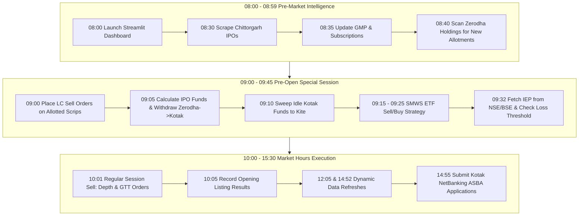

# CapitalFund1 — Daily Schedule & Execution Workflows

## 1. Master Daily Trading Schedule

CapitalFund1 runs on a strict daily operational clock aligned with Indian equity market sessions (08:00 AM – 15:30 PM IST).

| Time (IST) | Scheduled Function | Module Source | Purpose & Actions Taken |
| :--- | :--- | :--- | :--- |
| **08:00** | `launch_streamlit_dashboard()` | `dashboard.py` | Checks TCP port 8501; launches Streamlit Control Hub if not already active. |
| **08:30** | `ipo_entry()` | `common_master_functions.py` | Scrapes Chittorgarh for newly announced Mainboard and SME IPOs into `General.xlsx`. |
| **08:35** | `update_dynamic_data()` | `common_master_functions.py` | Refreshes Grey Market Premium (GMP), analyst ratings, and subscription figures. |
| **08:40** | `allotment_general()` | `allotment_general.py` | Logs into multi-account Zerodha portfolios, discovers newly allotted scrips, and writes to `allotted_holdings.xlsx`. |
| **09:00** | `ss_start_lc_sell()` | `ss_sale_order_on_lc_on_start_of_ss.py` | Detects today's listing allotments (`status == 5`) and submits Lower Circuit (LC) sell orders during pre-open. |
| **09:05** | `money_withdraw()` | `fund_manager.py` | Computes Day-0 and Day-1 IPO capital requirements and withdraws needed amounts from Zerodha to Kotak Bank. |
| **09:10** | `bank_to_kite()` | `fund_transfer_for_smws.py` | Sweeps idle Kotak Bank balances back into Zerodha Kite for SMWS trading. |
| **09:15** | `smws_seller()` | `trader_smws.py` | Executes sell orders for SMWS ETFs (`NIFTYIETF`, `TATAGOLD`, `TATSILV`) based on Google Sheet strategy signals. |
| **09:20** | `priority_ipo_sell_smws()` | `trader_priority_ipo_smws_sell.py` | Liquidates SMWS ETFs if additional funds are urgently required for high-priority closing IPOs. |
| **09:25** | `smws_buyer()` | `trader_smws.py` | Allocates available margin to purchase SMWS ETFs based on strategy buy signals. |
| **09:32** | `cancel_sale_order_if_loss()`| `ss_Before_session_close_cancel_sale_or_not.py` | Queries NSE/BSE indicative prices; cancels pre-open LC sell orders if expected listing loss exceeds thresholds. |
| **10:01** | `regular_session_ipo_sell()`| `regular_session_sell.py` | Analyzes market depth, evaluates Upper Circuit for 30 min, or places stepped GTT sell orders (+2%/+5% or +0.5%/+1.0%). |
| **10:05** | `listing_result()` | `ipo_listing_result.py` | Verifies opening listing price vs issue price on Chittorgarh; updates Column D (1 = Positive, 0 = Negative). |
| **12:05** | `update_dynamic_data()` | `common_master_functions.py` | Mid-day refresh of GMP and live institutional/retail subscription metrics. |
| **14:52** | `update_dynamic_data()` | `common_master_functions.py` | Final pre-close refresh of subscription metrics to finalize priority scoring. |
| **14:55** | `ipo_application()` | `allotment_application_ipo.py` | Submits ASBA/UPI IPO applications via Kotak NetBanking for IPOs closing today; logs to `IPO-applied.xlsx`. |

---

## 2. In-Depth Operational Workflows

---

### Workflow 1: IPO Research, Scoring & Database Synchronization
1. **Scraping Trigger (`08:30`, `08:35`, `12:05`, `14:52`)**:
   - `ipo_scraper.py` queries Chittorgarh's live IPO pages.
   - Filters out infrastructure investment trusts (InvITs), REITs, and listings without defined issue prices (`page_contains_trust()`, `is_data_available()`).
2. **Feature Extraction**:
   - GMP values scraped and cleaned from text (removes rupee symbols, percentages).
   - Retail, QIB, and NII subscription multiples parsed from tables.
   - P/E ratio and sector valuations extracted.
   - Live India VIX retrieved via `yfinance` (`^INDIAVIX`).
3. **Database Write**:
   - New entries appended to `General.xlsx` under `IPOMB` (Mainboard) or `IPOSME` (SME).
   - Excel formulas dynamically injected (`ipo_write_formula.py`) to calculate apply priority (`1` = Apply, `2` = High Priority Apply, `3` = Super Priority).

---

### Workflow 2: Fund Management & Automated Bank-Broker Routing
1. **Capital Estimation (`09:05`)**:
   - `fund_manager.py` computes total capital needed:
     $$\text{Total Required} = \text{Day 0 Required} + (0.9 \times \text{Day 1 Required})$$
   - SME application allotment reserve: ₹280,000 per application.
   - Mainboard application reserve: ₹209,000 (sNII/Retail).
2. **Balance Fetching**:
   - Logs into Kotak NetBanking via Playwright.
   - Intercepts 2FA OTP via IMAP from connected Gmail inbox.
   - Extracts current savings account balance.
3. **Withdrawal Dispatch**:
   - If $\text{Total Required} > \text{Bank Balance}$: Calculates deficit ($\Delta$).
   - Navigates to Zerodha Console (`console.zerodha.com/funds/withdraw`).
   - Submits withdrawal request for $\Delta$.
   - Sends instant push alert to Telegram.
4. **Surplus Sweep (`09:10`)**:
   - If bank balance exceeds safety margin and no IPOs require funds, `fund_transfer_for_smws.py` transfers surplus to Kite for trading.

---

### Workflow 3: Systematic ETF Trading (SMWS)
1. **Signal Evaluation (`09:15` Sell, `09:25` Buy)**:
   - Queries Google Sheet CSV export via `strategy_sheet.py`.
   - Inspects signal indicators for `NIFTYIETF`, `TATAGOLD`, and `TATSILV`.
2. **Order Sizing**:
   - Queries available Zerodha margin via `trader_zerodha_base.py`.
   - Divides available capital into equal slices across active signals:
     $$\text{Capital Per Security} = \frac{\lfloor \text{Available Margin} / 3 \rfloor}{\text{Number of Active Buy Signals}}$$
   - Enforces minimum threshold of ₹2,000 per security.
3. **Emergency Preemption (`09:20`)**:
   - If `priority_ipo_sell_smws()` detects that today's closing IPOs require cash and available bank funds are insufficient, SMWS ETF holdings are automatically liquidated to replenish cash reserves.

---

### Workflow 4: IPO Allotment Detection & Enrichment
1. **Holdings Inspection (`08:40`)**:
   - `allotment_general.py` launches Playwright for each user account.
   - Scans Zerodha Kite `/holdings`.
   - Discards predefined ETF symbols (`NIFTYIETF`, `TATAGOLD`, `TATSILV`, etc.).
2. **Portfolio Registration**:
   - Appends newly detected scrips to `allotted_holdings.xlsx` under the respective user's sheet (`UCI`).
   - Sets `shares_allocated`, `lot_size`, and `issue_price`.
   - Initializes `special_session_status = 5` (new allotment, pending listing execution).
   - Generates and dispatches an email alert with the updated `allotted_holdings.xlsx` attached.

---

### Workflow 5: Listing Day Execution (Special & Regular Sessions)
1. **09:00 AM (Special Session Start)**:
   - Scans `allotted_holdings.xlsx` for rows where `special_session_status == 5`.
   - Immediately submits a market Lower Circuit (LC) sell order via Zerodha Kite.
   - Updates `special_session_status = 1` (order placed).
2. **09:32 AM (Indicative Price Discovery & Cancel Gate)**:
   - Scrapes Indicative Equilibrium Price (IEP) from NSE and BSE discovery pages.
   - Calculates potential listing loss percentage:
     $$\text{Loss \%} = \frac{\text{Issue Price} - \text{Indicative Price}}{\text{Issue Price}} \times 100$$
   - **Mainboard Rule**: If $\text{Loss \%} > 11.9\%$, cancels the sell order (`special_session_status = 3`, `regular_session_status = 1`).
   - **SME Rule**: If $\text{Loss \%} > 0\%$, cancels the sell order.
   - If listing is healthy/positive, order remains in queue and executes at open (`special_session_status = 2`).
3. **10:01 AM (Regular Trading Session)**:
   - For scrips with `regular_session_status == 1`:
   - Inspects live market depth (Buy Qty vs Sell Qty).
   - Computes Buyer/Seller ratio:
     - **High Demand ($\ge 60\%$)**: Waits 30 minutes for Upper Circuit (UC). If UC reached, holds shares locked (`status = 5`). If no UC after 30 min, places 2 GTT orders:
       - 50% shares @ $\text{LTP} + 2.0\%$
       - 50% shares @ $\text{LTP} + 5.0\%$
     - **Weak Demand ($< 60\%$)**: Immediately places defensive stepped GTT orders:
       - 50% shares @ $\text{LTP} + 0.5\%$
       - 50% shares @ $\text{LTP} + 1.0\%$
   - Updates `regular_session_status = 2`.

---

### Workflow 6: Automated IPO Application (`14:55`)
1. **Closing IPO Identification**:
   - `allotment_application_ipo.py` queries `General.xlsx` for IPOs closing on `today().day`.
   - Categorizes by apply priority (`3`, `2`, `1`).
2. **Lot & Category Calculation**:
   - High Net-Worth Individual (HNI / sNII): Computes minimum lots to cross ₹200,000 threshold:
     $$\text{Lots Needed} = \left\lceil \frac{200,001}{\text{Min Shares} \times \text{Cutoff Price}} \right\rceil$$
   - Retail: Uses 1 minimum lot.
3. **Kotak ASBA Submission**:
   - Playwright logs into Kotak NetBanking.
   - Enters ASBA IPO module, selects target IPO name via fuzzy string matching.
   - Submits application, extracts application reference number.
   - Logs application details to `IPO-applied.xlsx` and dispatches Telegram notification.
